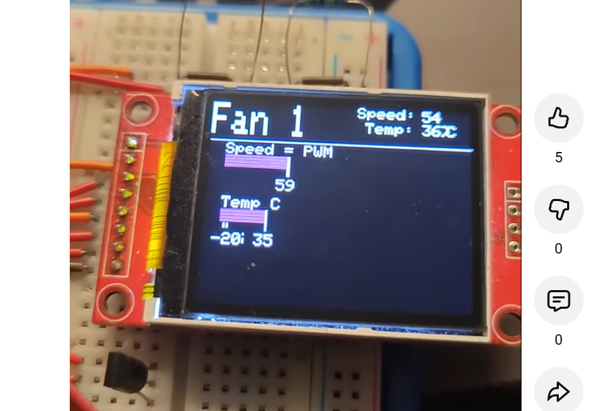

# FanCon – ESP32 Lüftersteuerung mit TFT

Kurz: Arduino/ESP32-Projekt für PWM-Lüfter mit ST77xx-TFT, Menü und Temperaturregelung.

---

## Inhalt
- `src/main.cpp` – Hauptsketch (dein Originalcode, modularisiert)  
- `src/FanControl.h` – Lüfterregelungsklasse  
- `src/boards.h` – Pins pro Board  
- `src/Config.h` – Feature-Flags, Farben  
- `platformio.ini` – Build-Setup für ESP32 (Arduino-Framework)  
- `docs/wiring.md` – Pinout  

---

## Build (PlatformIO)
1. VS Code + PlatformIO installieren  
2. Projektordner öffnen  
3. Environment: `env:esp32dev`  
4. Upload: ▶ „Upload“  

👉 Alternativ Arduino IDE: Dateien manuell zusammenführen.  

---

## Nächste Schritte
- TMP36-Conversion auf ESP32 korrekt umsetzen  
- `analogWrite` auf ESP32 → `ledc*`-API  
- Buttons mit `INPUT_PULLUP` und Flankenerkennung  
- README mit weiteren Fotos ergänzen  

---

## Screenshot
Hauptanzeige mit PWM-Steuerung und Temperaturauswertung:  

